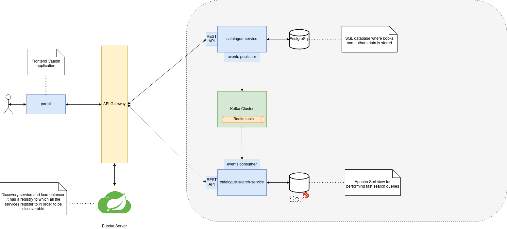

# Microservices library app
A simple web application built in order to explore the tools offered by Spring framework for building 
microservices based applications.

The application is basically just a simple CRUD with a UI that allows users to perform fast searches over 
a catalogue of books. 

All the backend services of the application are Dockerized, so it is possible to start them just 
by running the following Docker Compose command:
```
docker-compose -f docker-compose.yaml up
```
The frontend module is a SpringBoot application that can run as a standalone application.


## Architecture


The application is composed by the following services:
- **Catalogue service**: it allows performing CRUD operations over the books catalogue through the REST APIs it exposes. It publishes domain events on a Kafka topic, so that the other services can register to it in order to be informed about the changes that happen on the books catalogue stored in its database. 
- **Catalogue search service**: it exposes REST APIs for performing fast searches over the book catalogue. It registers to the Kafka topic on which the domain events are published in order to keep updated a view stored on Apache Solr, which is an enterprise search platform. 
- **Portal**: SpringBoot application that exposes a Vaadin UI to the users.
- **API gateway**: entrypoint to the backend services of the application. It performs mere request routing.
- **Eureka server**: discovery service that allows the API gateway to perform request routing without knowing the addresses of the services to which it forwards the request.
- **Kafka cluster**: message broker 